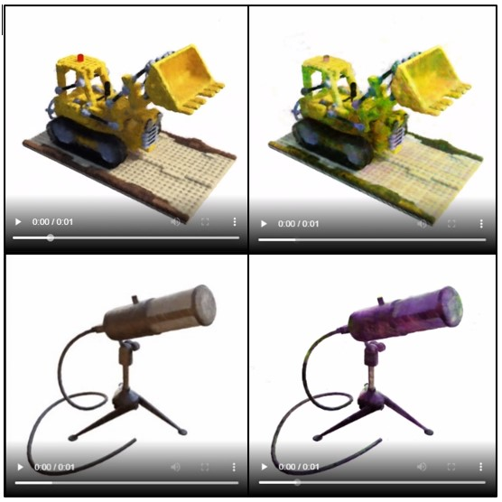

Project submission for Computer Vision, NYU Fall 2020 semester. Two parts:

**Bounding Box + Depth Regularization + Mesh Reconstruction:**

See ./mesh/run.txt for instructions on how to run these experiments.

**HyperNeRF:**
Two Colab notebooks can be used to view results. No running is needed, as intermediate values are saved from last runtime.

Initial Experimentation: https://colab.research.google.com/drive/1e59wWRycoYnqnnPzrdCWwtJQ3Rx4_mkM?usp=sharing

Teacher Student training: https://colab.research.google.com/drive/125d5MOD7JgYxCvtw6U4G32Nrs1wjwQti?usp=sharing

One additional Colab notebook which shows "Augmented" NeRF failure: https://colab.research.google.com/drive/1CQlbvjQK17EgOvh91vaE5D4aY-DTVivw?usp=sharing

